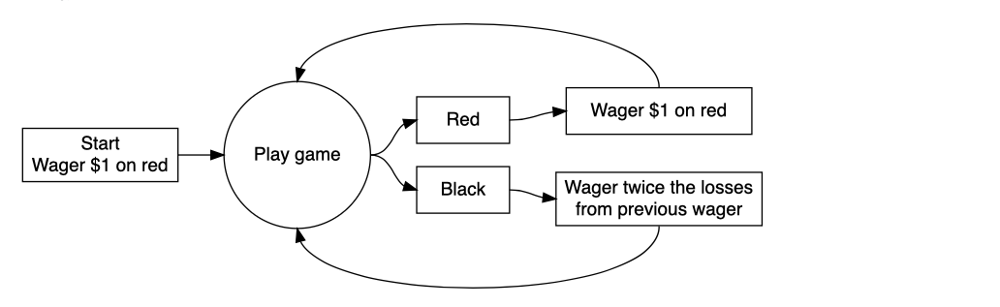
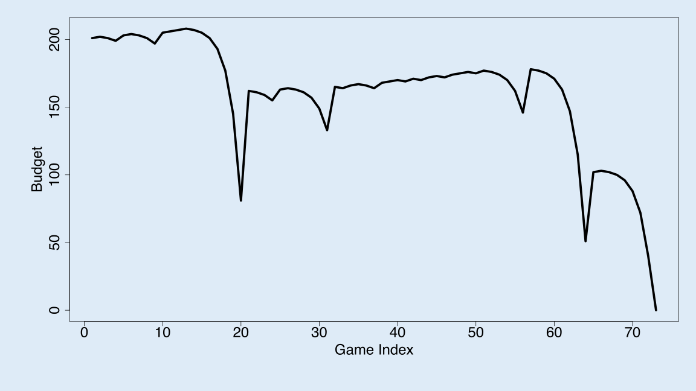
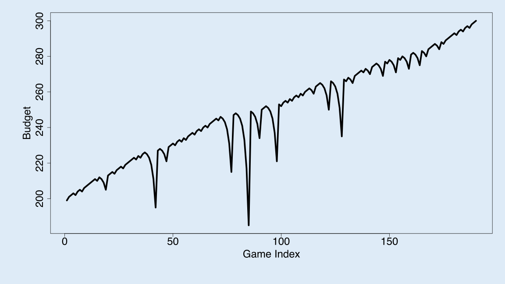

```{r global options, include = FALSE}
knitr::opts_chunk$set(echo=TRUE, warning=FALSE, message=FALSE, cache=TRUE)
```

+ You MUST submit your first version of the assignment before 9am on the "First Submission Due Date"(unless otherwise specified). 

+ You MUST pass the assignment before or on the "Resubmission Final Due Date". 

**How grading works:** You will be given the change to resubmit 2-3 times during the 2 weeks between the first given feedback and the Resubmission Final Due Date. This means you get a total of 4-5 "chances" to pass the assignment. Each time the TA will give you feedback about what to change in your code or your explanations. The TA that is grading that particular assignment will announce what dates they are grading each resubmission. 

+ This entire template is a "suggestion" and does not need to be followed 100%. 

# Introduction 

+ The audience of your blog post is a sharp college freshman with little to no background in data science.

+ You should explain how you used computer simulation to calculate the average earnings of a gambler that uses this strategy. As part of the explanation, provide a figure (or a series of figures) that show how the gamblers earnings (or losses) evolve over a series of wagers at the roulette wheel. (The x-axis will be the wager number (or play number), the y-axis will be earnings.) The code below provides all the functions you’ll need to calculate average earnings.

+ Show your audience how changing a parameter of the simulation (see table below) does or does not have an impact on average earnings. A figure would be helpful.

+ See the stopping rule below. Explain to your audience how you used computer simulation to estimate the average number of plays before stopping. The code below will need to be modified to calculate this quantity.

+ Be sure to explain the limitations of the simulation; identify simplifications or other sources of uncertainty.

## Background

Roulette is a casino game which was likely developed from the Italian game Biribi. Most of the casinos has this game. A roulette table composed of 38 evenly sized pockets on a wheel. The pockets has color and numbers on it. Usually there will be a ball pushing into the wheel, where the ball stops will be the winner of the game. It is randomly selected. The color has 2 green, 18 red and 18 black. Gamblers can water on several aspects of the outcome. In our case, we will focus on beting on color. For example, gambler bet only on red or black. If the gambler bet $1 dollar on black, and the random selected pocket is black, then the gamblr can get his original $1 dollar and an additional $1 as winnings. 

There is one strategy called the "Martingale" strategy. For example, you start your wager with $1 on red. If the outcome is red, you keep wager $1 on red. If the outcome is black, you wager twice the losses from previous wager. 
```{r}

```


# Methods

We will first set up the simulation of one play for the roulette game. 

```{r}
library(dplyr)
library(magrittr)
library(knitr)
one_play <- function(state){
  
    # Wager
    proposed_wager <- ifelse(state$previous_win, 1, 2*state$previous_wager)
    wager <- min(proposed_wager, state$M, state$B)
    
    # Spin of the wheel
    red <- rbinom(1,1,18/38)
    
    # Update state
    state$plays <- state$plays + 1
    state$previous_wager <- wager
    if(red){
      # WIN
      state$B <- state$B + wager
      state$previous_win <- TRUE
    }else{
      # LOSE
      state$B <- state$B - wager
      state$previous_win <- FALSE
    }
  state
}
```

Setting up the stopping rule. If the gambler lost all of his money, which B is less or equal to 0, the game will end. If the gambler reach the budget threshold, he will leave the table. If he hasn't lose all of his money or reach the threshold, but he reach the maximum number of plays, he will also stop playing. 

```{r}
stop_play <- function(state){
  if(state$B <= 0) return(TRUE)
  if(state$plays >= state$L) return(TRUE)
  if(state$B >= state$W) return(TRUE)
  FALSE
}
```


#' Play roulette to either bankruptcy, success, or play limits
#'
#' @param B number, the starting budget
#' @param W number, the budget threshold for successfully stoping
#' @param L number, the maximum number of plays 
#' @param M number, the casino wager limit
#' @return A vector of budget values calculated after each play.
```{r}
one_series <- function(
    B = 200
  , W = 300
  , L = 1000
  , M = 100
){

  # initial state
  state <- list(
    B = B
  , W = W
  , L = L
  , M = M
  , plays = 0
  , previous_wager = 0
  , previous_win = TRUE
  )
  
  # vector to store budget over series of plays
  budget <- rep(NA, L)
  
  # For loop of plays
  for(i in 1:L){
    new_state <- state %>% one_play
    budget[i] <- new_state$B
    if(new_state %>% stop_play){
      return(budget[1:i])
    }
    state <- new_state
  }
  budget    
}

```

```{r}
get_last <- function(x) x[length(x)]
```

In the simulation, there will be 10,000 trail be performed. Each of their result will be recorded and use for the mean calculation. Base on the simulation, the average earning of all the gamblers are $-46.46. The reason being negative is all the gamblers walked out either with bankruptcy or with reaching their winning threshold. The result showing the probability of winning is higher then losing, why would the average winning be negative? We will explain this on later section when we adjusting the parameters. Below are two graphs of gamblers earnings and losses. For the loser, there will be up and downs in the graph, but eventually he doesn't have enough budget to continue. He can only stop due to the budget limitation. For the winner graph, he is fortunate enough to reach the winning threshold and walk out with wining money. Turns out, there will only be 2 result, lose all or win up to the threshold. The shape of their graph will be different. 
```{r}
walk_out_money <- rep(NA, 10000)
for(j in seq_along(walk_out_money)){
  walk_out_money[j] <- one_series(B = 200, W = 300, L = 1000, M = 100) %>% get_last
}
```

**Loser Graph**
```{r}

```
this is the loser graph. Showing the gambler's money when he is gambling. There are gain and lose, but eventually it goes to 0. 
**Winner Graph**
```{r}

```
this is the winner graph. It shows how a gambler wins. He might lose his money somehow, he will walkout with winning money. 


```{r}
hist(walk_out_money, breaks = 100)
```
This graph shows the frequency of winning and losing. There is no walkout in the middle. A gambler either win or lose. 

```{r}
mean(walk_out_money > 200)

```
This is the rate of winning of the simulatino. It is higher than 50%.


```{r}
mean(walk_out_money - 200)
```
This is the average winning of the simulation. It is negative, means the gambler walkout with losing money. 


Finding the Average Stop
```{r}
total_play <- rep(NA, 10000)
for(j in seq_along(total_play)){
  total_play[j] <- one_series(B = 200, W = 300, L = 1000, M = 100) %>% length
}
mean(total_play)
```
This is the simulation code that can generate the average bet of the gambler before they stop playing. The function get_last is replaced by length, so the code can catch the length of the simulation ran for each trail. It took average 202 times of bet before the gambler can leave the casino with either win or bacnkrupcy. 


# Results
```{r}
walk_out_money <- rep(NA, 10000)
for(j in seq_along(walk_out_money)){
  walk_out_money[j] <- one_series(B = 250, W = 300, L = 1000, M = 100) %>% get_last
}
mean(walk_out_money>200)
mean(walk_out_money-200)
```
increased B from 200 to 250, give a winning rate at 0.7356. The walkout money is also showed.

```{r}
walk_out_money <- rep(NA, 10000)
for(j in seq_along(walk_out_money)){
  walk_out_money[j] <- one_series(B = 100, W = 1000, L = 1000, M = 100) %>% get_last
}
mean(walk_out_money>200)
mean(walk_out_money-200)
```
increased the threshold from 300 to 1000, resulted a lower winning rate at 0.0858. The walkout money lowered significantly. 
```{r}
walk_out_money <- rep(NA, 10000)
for(j in seq_along(walk_out_money)){
  walk_out_money[j] <- one_series(B = 200, W = 300, L = 10000, M = 100) %>% get_last
}
mean(walk_out_money>200)
mean(walk_out_money-200)
```
Changing the L will not affect the winning rate much. The average gain is still negative. 

```{r}
walk_out_money <- rep(NA, 10000)
for(j in seq_along(walk_out_money)){
  walk_out_money[j] <- one_series(B = 200, W = 300, L = 1000, M = 300) %>% get_last
}
mean(walk_out_money>200)
mean(walk_out_money-200)
```
Changing the max wager will not affect the winning rate much. The average gain almost remain the same. It is still negative. 

Changing the parameter. 
In our simulation, there are 4 variables, B, W, L, M. Each of the variables can be changed. By changing only the budget, more of the budget will result a higher probability of walking out with wining. Adjusting the winnings threshold for stopping, if the threshold is far beyond the budget, like $100 budget with $10000 threshold, it will lower the wining probability significantly. The closer the threshold to the budget, the higher over all winning probability will be. The stopping threshold can also affect the result. By lowering the stopping threshold will increase the average winning probability, and increase the average amount of money wined. The maximum wager doesn't affect the result significantly, because it is based on the budget of the gambler. If the gambler's total budget is lower than the maximum, it won't affect the result significantly. 


This simulation has variety of limitations: 
* The gambler has to wager $1 in the beginning. 
* The gambler has to bet on red or black only. In the real casino setting, gamblers' bet can vary. They can bet on certain number or series. 
* The maximum wager is defined as $100 in our simulation. In the real world, the maximum could be $500 or $1000 depends on the area, or even there won't be a maximum wager, as long as the gambler has enough money to bet. 

# Conclusions

Based on the simulation, the probability of walk out the casino with wining is 51.83%. However, this result is only performed based on the limitation we set. The result from the simulation only have 0 or 300, which means a gambler walkout either lose all of his money or reach the wining stopping threshold. To answer the question, this strategy is not guaranteed to be profitable. All the variables can be adjusted. It is true that this strategy do provides a slightly chance to win the casino. The probability has a inverse relationship with the winning threshold. When threshold is set to be more than 2 times of the budget will lose the advantage when using this strategy. If the winning threshold is lower than 2 times of the budget, this strategy can provide a chance to win the casino. 

