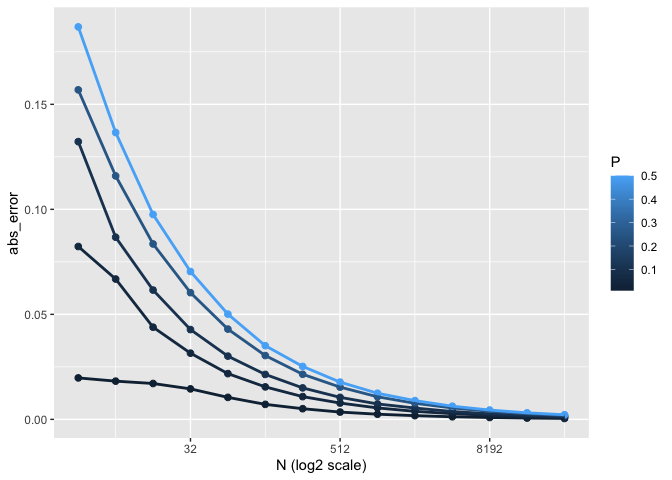
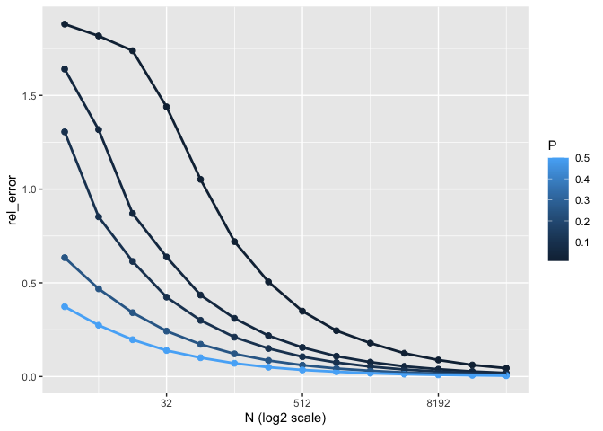
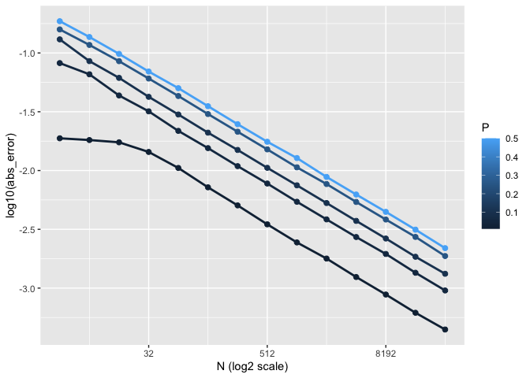
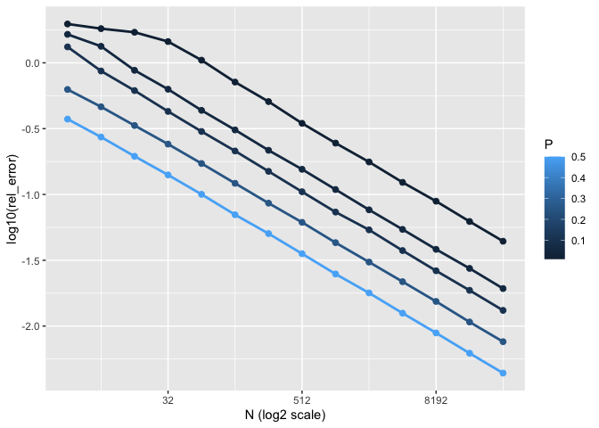

Untitled
================

``` r
library(tidyverse)
```

    ## ── Attaching packages ─────────────────────────────────────── tidyverse 1.3.1 ──

    ## ✓ ggplot2 3.3.5     ✓ purrr   0.3.4
    ## ✓ tibble  3.1.3     ✓ dplyr   1.0.7
    ## ✓ tidyr   1.1.3     ✓ stringr 1.4.0
    ## ✓ readr   2.0.1     ✓ forcats 0.5.1

    ## ── Conflicts ────────────────────────────────────────── tidyverse_conflicts() ──
    ## x dplyr::filter() masks stats::filter()
    ## x dplyr::lag()    masks stats::lag()

``` r
library(ggplot2)
output <- expand_grid(
  N= 2^c(2:15)
, P= c(0.01, 0.05, 0.10, 0.25, 0.50)
, abs_error= NA
, rel_error= NA
, KEEP.OUT.ATTRS = FALSE
)
#output <- arrange(output, P)
r <- 10000
for (i in 1:nrow(output)) {
  p <- output$P[i]
  n <- output$N[i]
  phat <- rbinom(r,n,p)/n
  output[i,"abs_error"] <-mean(abs(phat - p))
  output[i,"rel_error"] <-mean(abs(phat - p)/p)
}
```


    ```r
    ggplot(output,aes( N, abs_error) )+ geom_point(aes(color=P),size = 2) + geom_line(aes(group = P,color=P),size = 1) + scale_x_continuous(trans = "log2") + xlab("N (log2 scale)")  

<!-- -->

``` r
ggplot(output,aes( N, rel_error) )+ geom_point(aes(color=P),size = 2) + geom_line(aes(group = P,color=P),size = 1) + scale_x_continuous(trans = "log2") + xlab("N (log2 scale)") 
```

<!-- -->

``` r
ggplot(output,aes( N, log10(abs_error)) )+ geom_point(aes(color=P),size = 2) + geom_line(aes(group = P,color=P),size = 1) + scale_x_continuous(trans = "log2") + xlab("N (log2 scale)") 
```

<!-- -->

``` r
ggplot(output,aes( N, log10(rel_error)))+ geom_point(aes(color=P),size = 2) + geom_line(aes(group = P,color=P),size = 1) + scale_x_continuous(trans = "log2") + xlab("N (log2 scale)") 
```

<!-- -->
