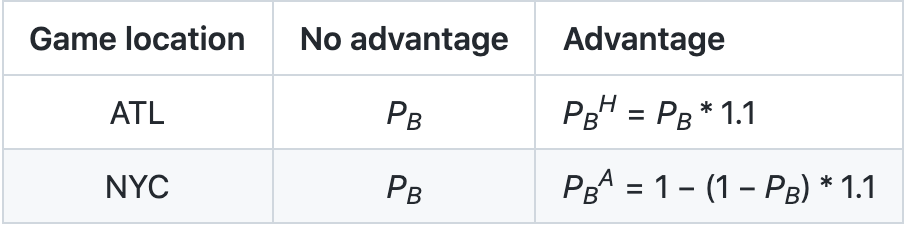

```{r setup, include=FALSE}
knitr::opts_chunk$set(echo = TRUE)
```
##Home Field Advantage 

The home field advantage is the edge which a team may have when playing a game at its home stadium. For example, it is the edge the Braves may have over the Yankees when the head-to-head match-up is in Atlanta. It is the advantage the Yankees may have when the head-to-head match-up is in New York.

The World Series is a first-to-4-wins match-up between the champions of the American and National Leagues of Major League Baseball. In this assignment, you are going to use simulation and analytic methods to compare the probability of winning the World Series with and without home field advantage.

Suppose that the Braves and the Yankees are teams competing in the World Series.

The table below has the two possible schedules for each game of the series. (NYC = New York City, ATL = Atlanta)
```{r}


```

Let PB be the probability that the Braves win a single head-to-head match-up with the Yankees, under the assumption that home field advantage doesn’t exist. Let PBH denote the probability that the Braves win a single head-to-head match-up with the Yankees as the home team (H for home). Let PBA denote the probability that the Braves win a single head-to-head match-up with the away team (A for away).

```{r}


```

1. Compute analytically the probability that the Braves win the world series when the sequence of game locations is {NYC, NYC, ATL, ATL, ATL, NYC, NYC}. (The code below computes the probability for the alternative sequence of game locations. Note: The code uses data.table syntax, which may be new to you. This is intentional, as a gentle way to introduce data.table.) Calculate the probability with and without home field advantage when PB = 0.55. What is the difference in probabilities?
```{r}
require(dplyr)
require(data.table)
# Get all possible outcomes
apo <- fread("all-possible-world-series-outcomes.csv")

# Home field indicator
hfi <- c(0,0,1,1,1,0,0) #{ATL, ATL, NYC, NYC, NYC, ATL, ATL} opposite

# P_B
pb <- 0.55
advantage_multiplier <- 1.1 # Set = 1 for no advantage
pbh <- 0.55*advantage_multiplier
pba <- 1 - (1 - 0.55)*advantage_multiplier

# Calculate the probability of each possible outcome
apo[, p := NA_real_] # Initialize new column in apo to store prob
for(i in 1:nrow(apo)){
  prob_game <- rep(1, 7)
  for(j in 1:7){
    p_win <- ifelse(hfi[j], pbh, pba)
    prob_game[j] <- case_when(
        apo[i,j,with=FALSE] == "W" ~ p_win
      , apo[i,j,with=FALSE] == "L" ~ 1 - p_win
      , TRUE ~ 1
    )
  }
  
  apo[i, p := prod(prob_game)] # Data.table syntax
}

# Sanity check: does sum(p) == 1?
apo[, sum(p)] # This is data.table notation

# Probability of overall World Series outcomes
apo[, sum(p), overall_outcome]
win<-apo[overall_outcome == "W"]
winprob <- sum(win$p)
winprob
```
The probability with home field advantage for the braves to win is 0.6042
## probability without home filed advantage
```{r}
pwithout <- pnbinom(3,4,0.55)
pwithout
pwithout -  winprob
```
The probability without home filed advantage for the braves to win is 0.6082
The difference is 0.00406. 
2. Calculate the same probabilities as the previous question by simulation.
##simulation probability with home filed advantage

```{r}

probB <- 0.55
probaH<- 0.55 *1.1
probaA<-1- (1-0.55)*1.1
homeoraway <-c(probaA,probaA,probaH,probaH,probaH,probaA,probaA)
simulation <- rep(NA,10000)
for (j in 1:100000) {
  serie <- rep(NA,7)
  for (i in 1:7) {
  serie[i]=rbinom(1,1,homeoraway[i])
  #print(serie)
  if (sum(serie,na.rm = TRUE)==4) {
      simulation[j]="W"
  break
  }
  else if(length(which(serie==0))==4){
  simulation[j]="L"
  break
  }
  else
  next
  }
  
}

simu_prob_w <- mean(simulation=="W")


simu_prob_w

```
The probability for Brave to win with home field advantage is 0.6028. 
##Simulation probability without home filed advantage
```{r}
simulation <- rep(NA,10000)
for (j in 1:100000) {
  serie <- rep(NA,7)
  for (i in 1:7) {
  serie[i]=rbinom(1,1,0.55)
  #print(serie)
  if (sum(serie,na.rm = TRUE)==4) {
      simulation[j]="W"
  break
  }
  else if(length(which(serie==0))==4){
  simulation[j]="L"
  break
  }
  else
  next
  }
  
}
simu_prob_without <- mean(simulation=="W")
simu_prob_without
simu_prob_w - simu_prob_without
```
The probability for Brave to win without home field advantage is 0.6065. 

The difference is 0.00367

3.What is the absolute and relative error for your simulation in the previous question?


## Absolute Error 
The formula of absolute error is use the actual result minus the measured value. 

Xerror = |X0 - X|

In this problem, we will use the difference between simulation and analytic result. 
The absolute error for Braves to win with home field advantage. 

```{r}
abs(simu_prob_w - winprob)
```

The absolute error for Braves to win withput home field advantage. 
```{r}
abs(simu_prob_without - pwithout)
```
## Relative Error
The formula for finding the Relative Error.

Xrelative_error = |X0 - X| / X 

The relative error for Braves to win with home field advantage. 
```{r}
abs(simu_prob_w - winprob)/winprob

```

The relative error for Braves to win without home field advantage. 

```{r}
abs(simu_prob_without - pwithout)/pwithout

```

4. Does the difference in probabilities (with vs without home field advantage) depend on PB? (Generate a plot to answer this question.)

Using the same code as the first one, we can add another loop and adjust the pb to a vector from 0.5 to 0.9. This can give us all the probabilities of Braves winning on different winnint Pb. 

```{r}
prob_with_home <- rep(NA,400)
prob_without_home <- rep(NA,400)
for (k in 1:400) {
apo <- fread("all-possible-world-series-outcomes.csv") 

hfi <- c(0,0,1,1,1,0,0) #{ATL, ATL, NYC, NYC, NYC, ATL, ATL} opposite

# P_B
pb <- 0.5 + 0.001*k
advantage_multiplier <- 1.1 # Set = 1 for no advantage
pbh <- pb*advantage_multiplier
pba <- 1 - (1 - pb)*advantage_multiplier

# Calculate the probability of each possible outcome
apo[, p := NA_real_] # Initialize new column in apo to store prob
for(i in 1:nrow(apo)){
  prob_game <- rep(1, 7)
  for(j in 1:7){
    p_win <- ifelse(hfi[j], pbh, pba)
    prob_game[j] <- case_when(
        apo[i,j,with=FALSE] == "W" ~ p_win
      , apo[i,j,with=FALSE] == "L" ~ 1 - p_win
      , TRUE ~ 1
    )
  }
  
  apo[i, p := prod(prob_game)] # Data.table syntax
}

# Sanity check: does sum(p) == 1?
#apo[, sum(p)] # This is data.table notation

# Probability of overall World Series outcomes
apo[, sum(p), overall_outcome]
win<-apo[overall_outcome == "W"]
prob_with_home[k] <- sum(win$p)
prob_without_home[k] <- pnbinom(3,4,pb)
}

plot(seq(0.501,0.9,0.001),prob_with_home-prob_without_home,type="l",lwd=5,xlab='Probability of Braves winning the serie',ylab='Difference in Probability',main="Difference between with and without home field advantage in probabilites ")
```

The value of Pb is the changing point of the difference. When it is greater than 0.6, the probability is positive. However, the difference do not have have a constant trend. It has increases and decreases. 


5. Does the difference in probabilities (with vs without home field advantage) depend on the advantage factor? (The advantage factor in PBH and PBA is the 1.1 multiplier that results in a 10% increase for the home team. Generate a plot to answer this question.)

By using the same code, we adjust the probability of Braves winning to a constant at 0.55. The home field advantage is starting from 1.0 and increase at 0.01 increment until 1.9. 

```{r}
prob_with_home <- rep(NA,90)
prob_without_home <- rep(NA,90)
for (k in 1:90) {
apo <- fread("all-possible-world-series-outcomes.csv") 

hfi <- c(0,0,1,1,1,0,0) #{ATL, ATL, NYC, NYC, NYC, ATL, ATL} opposite

# P_B
pb <- 0.55
advantage_multiplier <- 1 + k*0.01 # Set = 1 for no advantage
pbh <- pb*advantage_multiplier
pba <- 1 - (1 - pb)*advantage_multiplier

# Calculate the probability of each possible outcome
apo[, p := NA_real_] # Initialize new column in apo to store prob
for(i in 1:nrow(apo)){
  prob_game <- rep(1, 7)
  for(j in 1:7){
    p_win <- ifelse(hfi[j], pbh, pba)
    prob_game[j] <- case_when(
        apo[i,j,with=FALSE] == "W" ~ p_win
      , apo[i,j,with=FALSE] == "L" ~ 1 - p_win
      , TRUE ~ 1
    )
  }
  
  apo[i, p := prod(prob_game)] # Data.table syntax
}

# Sanity check: does sum(p) == 1?
#apo[, sum(p)] # This is data.table notation

# Probability of overall World Series outcomes
apo[, sum(p), overall_outcome]
win<-apo[overall_outcome == "W"]
prob_with_home[k] <- sum(win$p)
prob_without_home[k] <- pnbinom(3,4,pb)
}

plot(seq(1.01,1.9,0.01),prob_with_home-prob_without_home,type="l",lwd=5,xlab='Advantage Factor',ylab='Difference in Probability',main="Difference between with and without home field advantage in probabilites ")
```

We can observe from the plot that the probability difference starting decrease as the home filed advantage factor increases. The probability to win at Braves home field will increase with the home field advantage factor. Also, the probability to win in New York will decrease, because Yankee's probability of winning increases with the increase of home field advantage factor. Based on the series setting, the overall probability of winning the series will decrease as the home filed advantage factor increase, because Yankee has one additional home field than Braves. 
