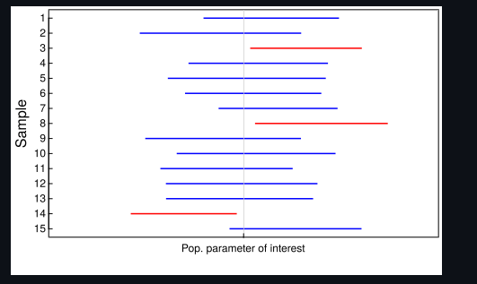

```{r setup, include=FALSE}
knitr::opts_chunk$set(echo = TRUE)
```


```{r}
library(stats4)
library(base)
library(dplyr)
library(tidyverse)
```

Step: Generate a single sample from a standard normal distribution of size N = 201. Explain to the reader how you use MLE to estimate the distribution.
```{r}
sampledis=c(201,0,1)

generate_data <- function(parameter){ 
  # Hard coded standard normal distribution
  rnorm(parameter[1],mean=parameter[2],sd=parameter[3]) 
}

estimation.mle <- function(data) {
  mle.mean=mean(data)
  mle.sd=sd(data)
  return(c(length(data),mle.mean,mle.sd))
}
sampledis %>% generate_data %>%  estimation.mle()
```

Step: Show the reader how you approximate the sampling distribution of the median, conditional on the estimate of the distribution in the previous step.
```{r}
boot_ci <- function(parameter1){
  # Hard coded number of draws
  R <- 5000
  
  sampdist <- rep(NA, R)
  for(i in 1:R){
    
    sampdist[i] <- parameter1 %>% generate_data %>% median
  }
  # Hard coded symmetric density interval
  quantile(sampdist, c(0.025, 0.975))
}
capture_median <- function(ci){
  # Hard coded 0 as parameter of interest
  1*(ci[1] < 0 & 0 < ci[2])
}
```

Step: Describe how you calculate a 95% confidence interval from the approximated sampling distribution.
```{r}

```

Step: Explain the concept of coverage probability. Explain your code for calculating the coverage probability.
```{r}


```

Step: Perform the simulation and report the results.
```{r}
M <- 1000 # Make small, we are still testing the code
captures <- rep(NA, M)
for(i in 1:M){
  captures[i] <- 
    sampledis %>% generate_data %>% estimation.mle%>%  boot_ci %>% capture_median
}
capture_prob <- mean(captures)
capture_prob
```

Step: Describe how you might change the simulation to learn more about the operating characteristics of your chosen method for constructing the 95% confidence interval.


