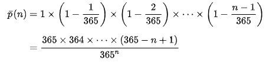

```{r setup, include=FALSE}
knitr::opts_chunk$set(echo = TRUE)
```

#Setting
This solution is based on the assumption that each day have the same probability for birthday. The condition such as leap year, twins, and etc. are not included. 


```{r}
library(ggplot2)
library(tidyverse)
library(dplyr)
library(knitr)
library(tidyr)
library(magrittr)
```

```{r}

generate_class <- function(class_size){
  birthdays <- sample(1:366, class_size, replace = TRUE, prob = c(rep(1,365), .25))
  data.frame(student_id = 1:class_size, birthday = birthdays)
}

check_birthday <- function(class){
  class_summary <- class %>% 
    summarize(n = n(), n_bday = n_distinct(birthday)) %>% 
    mutate(shared = n > n_bday)
  class_summary[["shared"]]
}


```
This is building the function of the simulation. 


```{r}
classsize <- 1:80
classsize
simulation <- matrix(ncol = ,nrow = 80)
for (i in classsize) {
  replicates <- replicate(100, i %>% generate_class %>% check_birthday)
  simulation[i,] <- mean(replicates)
}
simulation <- data.frame(simulation)


```
This is using the simulation to find the result. Each senario is simulated 100 times due to time limit. The probablity is the using the number of same birthday exist divided by the total number of simulation ran for the number of people. 
```{r}
analytic <-  matrix(ncol = ,nrow = 80)
i<-2:80
y<-365
x<-0
z <- 0
for (value in i) {
  x = value
  z= 365^x
  while (x>=2) {
    y = y*(365-x+1)
    x = x - 1
  }
  y<- y / z
  y=1-y
  print(y)
  analytic[value,]<- y
  y <- 365
  x<- 0
  z<-0
}
analytic[1,]<- 0

365^5
library(plyr)
analytic <-data.frame(analytic)


```
There is a while loop inside a for loop. It is calculated by the probability of each conditions with different people. Below is the equation used to calculate the probability. 
```{r}


```


```{r}
table1 <- merge(simulation,analytic,by=0)
table1$Row.names <- as.numeric(table1$Row.names)   
table1 <- arrange(table1,Row.names)
table1 <- table1 %>%
  pivot_longer(c(`simulation`, `analytic`), names_to = "solution", values_to = "proba")
table1 %>%
  group_by(solution) #%>%
  ggplot(table1,aes(x=Row.names,y=proba)) + geom_point(size=0.5) + geom_line(aes(group = solution,color=solution )) + scale_color_manual(labels=c("Analytic Solution","Simulation Solution"),values=c("red","blue")) + theme(legend.title = element_blank()) +labs(title = "Prob of Same Birthday from 1 to 80 People",y="Probability",x= "Number of People" )

```
this is using ggplot to generate the plot. 
## Graph of the two approaches. 

## Pros and Cons
Using the simulation, it gives a real world setting. Every time it will give a random result. It is similar to real world setting that everytime people comein differently. It has 100 simulations. It took the average. We can observe the variations. The analytic is based on calculation only. The probability will not change. It is more on the math side. The disadvantage of the simulation is the result maybe biased, because there might have higher probalilty at less people due to the number of simulations. The simulation also take times to run if you increase the number of simulations. The analytic cannont run after certain values, because the size of the number will go beyond the calculation limit for computers. 


