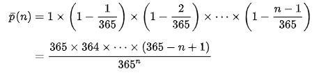

birthday problem
================

\#Setting This solution is based on the assumption that each day have
the same probability for birthday. The condition such as leap year,
twins, and etc. are not included.

``` r
library(ggplot2)
library(tidyverse)
```

    ## ── Attaching packages ─────────────────────────────────────── tidyverse 1.3.1 ──

    ## ✓ tibble  3.1.3     ✓ dplyr   1.0.7
    ## ✓ tidyr   1.1.3     ✓ stringr 1.4.0
    ## ✓ readr   2.0.1     ✓ forcats 0.5.1
    ## ✓ purrr   0.3.4

    ## ── Conflicts ────────────────────────────────────────── tidyverse_conflicts() ──
    ## x dplyr::filter() masks stats::filter()
    ## x dplyr::lag()    masks stats::lag()

``` r
library(dplyr)
library(knitr)
library(tidyr)
library(magrittr)
```

    ## 
    ## Attaching package: 'magrittr'

    ## The following object is masked from 'package:purrr':
    ## 
    ##     set_names

    ## The following object is masked from 'package:tidyr':
    ## 
    ##     extract

``` r
generate_class <- function(class_size){
  birthdays <- sample(1:366, class_size, replace = TRUE, prob = c(rep(1,365), .25))
  data.frame(student_id = 1:class_size, birthday = birthdays)
}

check_birthday <- function(class){
  class_summary <- class %>% 
    summarize(n = n(), n_bday = n_distinct(birthday)) %>% 
    mutate(shared = n > n_bday)
  class_summary[["shared"]]
}
```

This is building the function of the simulation.

``` r
classsize <- 1:80
classsize
```

    ##  [1]  1  2  3  4  5  6  7  8  9 10 11 12 13 14 15 16 17 18 19 20 21 22 23 24 25
    ## [26] 26 27 28 29 30 31 32 33 34 35 36 37 38 39 40 41 42 43 44 45 46 47 48 49 50
    ## [51] 51 52 53 54 55 56 57 58 59 60 61 62 63 64 65 66 67 68 69 70 71 72 73 74 75
    ## [76] 76 77 78 79 80

``` r
simulation <- matrix(ncol = ,nrow = 80)
for (i in classsize) {
  replicates <- replicate(100, i %>% generate_class %>% check_birthday)
  simulation[i,] <- mean(replicates)
}
simulation <- data.frame(simulation)
```

This is using the simulation to find the result. Each senario is
simulated 100 times due to time limit. The probablity is the using the
number of same birthday exist divided by the total number of simulation
ran for the number of people.

``` r
analytic <-  matrix(ncol = ,nrow = 80)
i<-2:80
y<-365
x<-0
z <- 0
for (value in i) {
  x = value
  z= 365^x
  while (x>=2) {
    y = y*(365-x+1)
    x = x - 1
  }
  y<- y / z
  y=1-y
  print(y)
  analytic[value,]<- y
  y <- 365
  x<- 0
  z<-0
}
```

    ## [1] 0.002739726
    ## [1] 0.008204166
    ## [1] 0.01635591
    ## [1] 0.02713557
    ## [1] 0.04046248
    ## [1] 0.0562357
    ## [1] 0.07433529
    ## [1] 0.09462383
    ## [1] 0.1169482
    ## [1] 0.1411414
    ## [1] 0.1670248
    ## [1] 0.1944103
    ## [1] 0.2231025
    ## [1] 0.2529013
    ## [1] 0.283604
    ## [1] 0.3150077
    ## [1] 0.3469114
    ## [1] 0.3791185
    ## [1] 0.4114384
    ## [1] 0.4436883
    ## [1] 0.4756953
    ## [1] 0.5072972
    ## [1] 0.5383443
    ## [1] 0.5686997
    ## [1] 0.5982408
    ## [1] 0.6268593
    ## [1] 0.6544615
    ## [1] 0.6809685
    ## [1] 0.7063162
    ## [1] 0.7304546
    ## [1] 0.7533475
    ## [1] 0.7749719
    ## [1] 0.7953169
    ## [1] 0.8143832
    ## [1] 0.8321821
    ## [1] 0.848734
    ## [1] 0.8640678
    ## [1] 0.8782197
    ## [1] 0.8912318
    ## [1] 0.9031516
    ## [1] 0.9140305
    ## [1] 0.9239229
    ## [1] 0.9328854
    ## [1] 0.9409759
    ## [1] 0.9482528
    ## [1] 0.9547744
    ## [1] 0.960598
    ## [1] 0.9657796
    ## [1] 0.9703736
    ## [1] 0.974432
    ## [1] 0.9780045
    ## [1] 0.9811381
    ## [1] 0.983877
    ## [1] 0.9862623
    ## [1] 0.9883324
    ## [1] 0.9901225
    ## [1] 0.991665
    ## [1] 0.9929894
    ## [1] 0.9941227
    ## [1] 0.9950888
    ## [1] 0.9959096
    ## [1] 0.9966044
    ## [1] 0.9971905
    ## [1] 0.9976831
    ## [1] 0.9980957
    ## [1] 0.99844
    ## [1] 0.9987264
    ## [1] 0.9989637
    ## [1] 0.9991596
    ## [1] 0.9993208
    ## [1] 0.9994529
    ## [1] 0.9995608
    ## [1] 0.9996486
    ## [1] 0.9997199
    ## [1] 0.9997774
    ## [1] 0.9998238
    ## [1] 0.999861
    ## [1] 0.9998907
    ## [1] 0.9999143

``` r
analytic[1,]<- 0

365^5
```

    ## [1] 6.478349e+12

``` r
library(plyr)
```

    ## ------------------------------------------------------------------------------

    ## You have loaded plyr after dplyr - this is likely to cause problems.
    ## If you need functions from both plyr and dplyr, please load plyr first, then dplyr:
    ## library(plyr); library(dplyr)

    ## ------------------------------------------------------------------------------

    ## 
    ## Attaching package: 'plyr'

    ## The following objects are masked from 'package:dplyr':
    ## 
    ##     arrange, count, desc, failwith, id, mutate, rename, summarise,
    ##     summarize

    ## The following object is masked from 'package:purrr':
    ## 
    ##     compact

``` r
analytic <-data.frame(analytic)
```

There is a while loop inside a for loop. It is calculated by the
probability of each conditions with different people. Below is the
equation used to calculate the probability.

``` r

```

<!-- -->

``` r
table1 <- merge(simulation,analytic,by=0)
table1$Row.names <- as.numeric(table1$Row.names)   
table1 <- arrange(table1,Row.names)
table1 <- table1 %>%
  pivot_longer(c(`simulation`, `analytic`), names_to = "solution", values_to = "proba")
table1 %>%
  group_by(solution) #%>%
```

    ## # A tibble: 160 × 3
    ## # Groups:   solution [2]
    ##    Row.names solution     proba
    ##        <dbl> <chr>        <dbl>
    ##  1         1 simulation 0      
    ##  2         1 analytic   0      
    ##  3         2 simulation 0.01   
    ##  4         2 analytic   0.00274
    ##  5         3 simulation 0.01   
    ##  6         3 analytic   0.00820
    ##  7         4 simulation 0.02   
    ##  8         4 analytic   0.0164 
    ##  9         5 simulation 0.02   
    ## 10         5 analytic   0.0271 
    ## # … with 150 more rows

``` r
  ggplot(table1,aes(x=Row.names,y=proba)) + geom_point(size=0.5) + geom_line(aes(group = solution,color=solution )) + scale_color_manual(labels=c("Analytic Solution","Simulation Solution"),values=c("red","blue")) + theme(legend.title = element_blank()) +labs(title = "Prob of Same Birthday from 1 to 80 People",y="Probability",x= "Number of People" )
```

<!-- --> this is
using ggplot to generate the plot. \#\# Graph of the two approaches.

## Pros and Cons

Using the simulation, it gives a real world setting. Every time it will
give a random result. It is similar to real world setting that everytime
people comein differently. It has 100 simulations. It took the average.
We can observe the variations. The analytic is based on calculation
only. The probability will not change. It is more on the math side. The
disadvantage of the simulation is the result maybe biased, because there
might have higher probalilty at less people due to the number of
simulations. The simulation also take times to run if you increase the
number of simulations. The analytic cannont run after certain values,
because the size of the number will go beyond the calculation limit for
computers.
